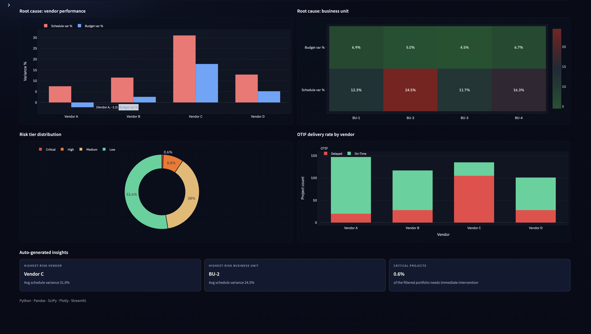

# Enterprise KPI Anomaly Detection — Procurement Risk Case Study

**Live dashboard:** [https://enterprise-kpi-anomaly-detection-g3zdebbbkxxnqubhjitn8z.streamlit.app/](https://enterprise-kpi-anomaly-detection-g3zdebbbkxxnqubhjitn8z.streamlit.app/)



> **Methodology note:** This is a methodology case study based on my experience building KRI tracking dashboards at Philips. No proprietary data is used. The synthetic dataset mirrors real enterprise procurement structures — project timelines, vendor performance, and budget variance across business units.

---

## Business Problem

An enterprise procurement organization manages 500 concurrent projects across 4 vendors and 4 business units. Project managers manually review timelines in Excel, discovering schedule and budget overruns only after they occur. Leadership needs an automated way to:

1. **Flag high-risk projects** before they breach schedule or budget thresholds
2. **Identify root causes** — which vendors and business units are driving most risk
3. **Prioritize intervention** using a risk matrix (schedule variance × budget variance)

## Methodology

1. **Data generation** — Synthetic procurement dataset (500 projects, 4 vendors, 4 BUs, 4 categories)
2. **Anomaly detection** — Absolute z-scores on schedule variance % and budget variance %
3. **Root cause analysis** — Group by vendor and business unit to surface systemic issues
4. **Risk matrix** — Scatter of schedule vs. budget variance, classified into Low / Medium / High / Critical
5. **Interactive dashboard** — Streamlit app with filters for vendor, BU, category, and risk tier
6. **SQL KRIs** — `analysis.sql` for vendor ranking, BU concentration, and intervention lists (not required to run the app)

## Data Architecture

```
generate_data.py → procurement_data.csv → app.py (Streamlit)
                         ↓
                   analysis.sql (KRI queries)
```

## Key Metrics Tracked

| Metric | Definition | Business use |
|---|---|---|
| Schedule Variance % | (Actual Days − Planned Days) / Planned Days | On-time delivery monitoring |
| Budget Variance % | (Actual Spend − Budget) / Budget | Cost overrun detection |
| Z-Score (Schedule) | \|value − mean\| / std of schedule variance | Outlier flagging |
| Z-Score (Budget) | \|value − mean\| / std of budget variance | Outlier flagging |
| Risk Tier | Composite of both z-scores | Prioritization |
| OTIF | On-Time if actual days ≤ 1.2× planned days | Delivery reliability |

## Risk Tier Logic

- **Critical:** Both z-scores > 2 (schedule **and** budget are outliers)
- **High:** Either z-score > 2 (one dimension is severely off)
- **Medium:** Either z-score > 1 (and neither exceeds 2)
- **Low:** Both z-scores ≤ 1

## Key Findings (synthetic run, n = 500)

- **Vendor C** is the clear schedule outlier: **+31.0%** average schedule variance and **+17.8%** budget variance. OTIF is **22.2%**, versus **86.4%** for Vendor A.
- **BU-2** has the highest average schedule variance (**~24.5–24.9%**). High + Critical *counts* are highest in BU-4 (17) and BU-2 (16).
- **9.4%** of the portfolio is High or Critical (44 High, 3 Critical). Critical is **0.6%** and is the immediate-intervention slice.
- Portfolio OTIF is **63.8%**. Delayed is defined as actual days above **1.2×** planned, not 1.4×.

These numbers match the live dashboard insights (highest-risk vendor = Vendor C, highest-risk BU = BU-2 by schedule variance, critical = 0.6%).

## Tech Stack

- **Python:** Pandas, NumPy (z-scores and synthetic data)
- **Streamlit:** Interactive dashboard with filters and auto-generated insights
- **Plotly:** Risk-matrix scatter, vendor bars, BU heatmap, OTIF stacked bars
- **SQL:** Optional KRI queries in `analysis.sql` (window functions, ranking)

## Repository Contents

| File | Purpose |
|---|---|
| `generate_data.py` | Generates the synthetic procurement dataset (500 projects, seed 42) |
| `procurement_data.csv` | Generated dataset |
| `app.py` | Streamlit dashboard |
| `analysis.sql` | KRI queries with window functions |
| `requirements.txt` | Dependencies |
| `dashboard.png` | Dashboard screenshot |

## How to Run

```bash
pip install -r requirements.txt
python generate_data.py
streamlit run app.py
```

The app also generates `procurement_data.csv` on first run if the file is missing.

## Author

Ishika Kour — M.Tech Data Analytics, NIT Jalandhar | Ex-Philips Analytics | GATE CSE/DA Qualified
